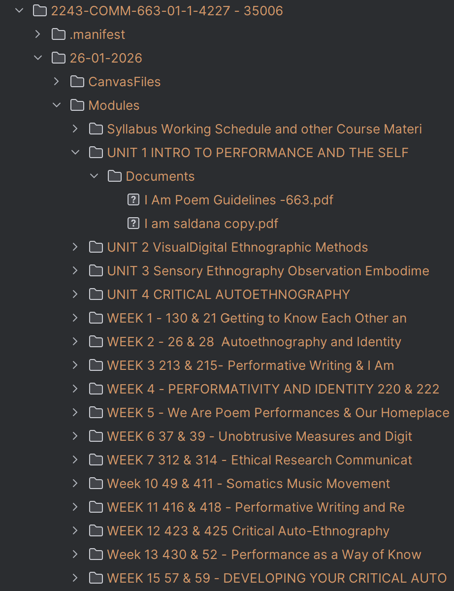
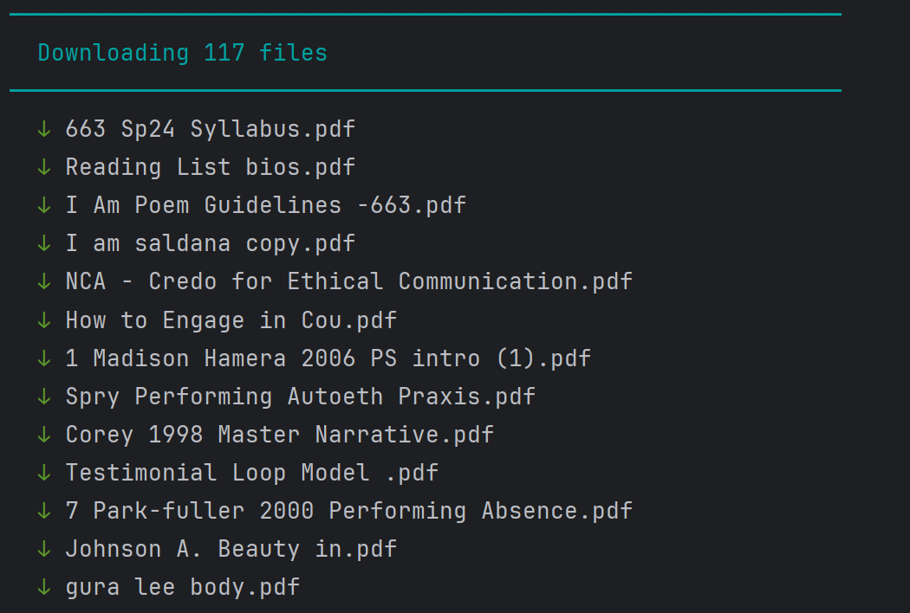
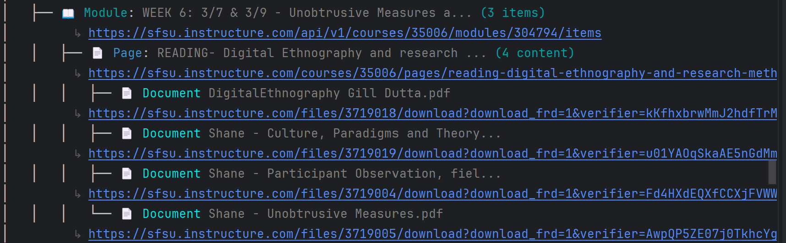
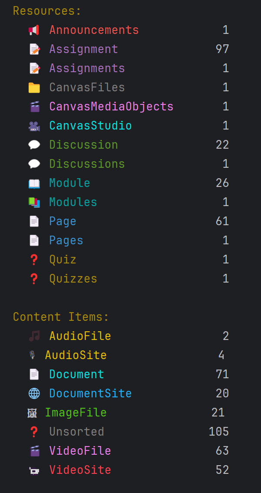

# CanvasBot

A command-line tool for downloading, auditing, and organizing content from Canvas LMS courses.

## Table of Contents

- [Overview](#overview)
  - [Features](#features)
  - [Content Types](#content-types)
- [Requirements](#requirements)
- [Installation](#installation)
- [Quick Start](#quick-start)
- [Usage](#usage)
  - [Downloading Files](#downloading-files)
  - [Exporting Data](#exporting-data)
  - [Pattern Management](#pattern-management)
  - [Course List Export](#course-list-export)
- [Configuration](#configuration)
- [Pipeline Testing](#pipeline-testing)
- [Program Flags Reference](#program-flags-reference)
- [Support](#support)
- [License](#license)

## Overview

CanvasBot is a Windows command-line tool designed for accessible media coordinators and instructional designers at universities. It connects to Canvas LMS via the REST API to:

- **Download** all files from courses (documents, videos, audio, images)
- **Categorize** embedded content by type using configurable regex patterns
- **Export** content inventories to Excel or JSON for accessibility auditing
- **Track** download progress to avoid re-downloading files

### Features

#### Structured File Downloads

Download course content into organized folder structures that mirror the Canvas course hierarchy. Files are organized by module, assignment, and content type for easy navigation.

```bash
Canvasbot.exe --course_id 12345 --download_folder "C:\Downloads" --include_video_files
```

**Output structure:**
```
Biology 101 - 12345/
├── 26-01-2026/
│   ├── Module 1 - Introduction/
│   │   ├── Week 1 Assignment/
│   │   │   └── Documents/
│   │   │       ├── Content Location.lnk  ← shortcut to Canvas page
│   │   │       └── syllabus.pdf
│   │   └── VideoFiles/
│   │       └── welcome_video.mp4
│   └── Module 2 - Cell Biology/
│       └── Documents/
│           └── lecture_notes.docx
```



---

#### Daily Incremental Downloads

CanvasBot tracks previously downloaded files in a manifest, so running it daily only downloads new content. Each run creates a date-stamped folder with only the files added since your last download.

```bash
# Run daily - only new files are downloaded
Canvasbot.exe --course_id 12345 --download_folder "C:\Downloads"
```

This makes it ideal for:
- Automated daily content audits
- Keeping local copies in sync with Canvas
- Archiving course materials over time



---

#### Visual Content Tree

Inspect course content structure directly in the terminal with a color-coded tree view. See all content types, hidden items, caption status, and clickable URLs at a glance.

```bash
# Content tree - only resources with content (hides empty branches)
Canvasbot.exe --course_id 12345 --print_content_tree

# Full course tree - shows all resources including empty ones
Canvasbot.exe --course_id 12345 --print_full_course
```

**Example output:**
```
🎓 Biology 101 | Course ID: 12345
│  ↳ https://yourschool.instructure.com/courses/12345
├── 📚 Modules
│   └── 📖 Module: Introduction to Biology
│       ├── 📄 Document: Syllabus.pdf
│       │               ↳ https://yourschool.instructure.com/files/123/download
│       ├── 🎬 VideoFile: Welcome Video.mp4
│       │               ↳ https://yourschool.instructure.com/files/456/download
│       └── 📹 VideoSite: Introduction Lecture
│                       ↳ https://www.youtube.com/watch?v=abc123
```

Features:
- Color-coded by content type
- `[hidden]` indicator for unpublished content
- Full URLs for easy access
- Content-only view hides empty modules and resource branches



After scanning, view a summary of all discovered content by type:



---

#### JSON Export for Integration

Export complete course content metadata to JSON for integration with other systems, custom reporting, or programmatic analysis.

```bash
Canvasbot.exe --course_id 12345 --output_as_json "C:\Reports"
```

Use cases:
- Feed into accessibility scanning tools
- Build custom dashboards
- Integrate with institutional reporting systems
- Archive course metadata

---

#### Excel Export for Analysis

Generate organized Excel workbooks (.xlsm) with content categorized across multiple sheets. Includes dropdown validation, conditional formatting, and hyperlinks for accessibility tracking workflows.

```bash
Canvasbot.exe --course_id 12345 --output_as_excel "C:\Reports"
```

**Sheets included:**
- Documents & Document Sites
- Video Files & Video Sites
- Audio Files & Audio Sites
- Image Files
- Unsorted Links

Features:
- Dropdown menus for tracking review status
- Hyperlinks to source pages and download URLs
- Hidden content flagging
- Ready for accessibility audit workflows

---

### Content Types

CanvasBot classifies content into these categories:

| Type | Description | Examples |
|------|-------------|----------|
| Documents | Downloadable document files | PDF, DOCX, PPTX, XLSX |
| Document Sites | Cloud document platforms | Google Docs, OneDrive |
| Video Files | Downloadable video files | MP4, MOV, MKV |
| Video Sites | Video hosting platforms | YouTube, Vimeo, Zoom |
| Audio Files | Downloadable audio files | MP3, M4A, WAV |
| Audio Sites | Audio/podcast platforms | Podcast links |
| Image Files | Image files | JPG, PNG, GIF |
| File Storage Sites | Cloud storage | Box, Google Drive |
| Digital Textbooks | E-textbook platforms | Cengage, McGraw-Hill |
| Canvas Studio | Canvas Studio embeds | Institution media |
| Unsorted | Unclassified links | Everything else |

## Requirements

- Windows operating system
- Canvas API Access Token (read access to courses)

## Installation

### Executable (Recommended)

Download the latest executable from [Releases](https://github.com/Fontaineconsult/canvas-bot-v2/releases).

This is a standalone executable - no Python installation required.

### From Source

```bash
git clone https://github.com/Fontaineconsult/canvas-bot-v2.git
cd canvas-bot-v2
pip install -r requirements.txt
python canvas_bot.py --help
```

## Quick Start

### First Run Setup

On first run, you'll be prompted for:

1. **Canvas identifier** - Your institution's subdomain (e.g., `sfsu` for `https://sfsu.instructure.com`). All URLs are auto-generated from this.
2. **API Access Token** - Generated from Canvas settings

### Basic Commands

```bash
# Download documents from a course
Canvasbot.exe --course_id 12345 --download_folder "C:\Downloads"

# Export course content to Excel
Canvasbot.exe --course_id 12345 --output_as_excel "C:\Reports"

# Export to JSON
Canvasbot.exe --course_id 12345 --output_as_json "C:\Reports"
```

## Usage

### Downloading Files

#### Single Course

```bash
Canvasbot.exe --course_id 12345 --download_folder "C:\Downloads"
```

#### Multiple Courses

Create a text file with course IDs (one per line):

```bash
Canvasbot.exe --course_id_list courses.txt --download_folder "C:\Downloads"
```

#### Include Additional File Types

By default, only documents are downloaded. Add flags for other types:

```bash
Canvasbot.exe --course_id 12345 --download_folder "C:\Downloads" \
    --include_video_files \
    --include_audio_files \
    --include_image_files
```

#### Flatten Directory Structure

Download all files to a single folder instead of preserving course structure:

```bash
Canvasbot.exe --course_id 12345 --download_folder "C:\Downloads" --flatten
```

#### Download Manifest

CanvasBot tracks downloaded files in `download_manifest.yaml` to prevent re-downloads. Each run creates a date-stamped folder with only new files. Delete the course folder to re-download everything.

#### Shortcuts for Failed Downloads

If a file cannot be downloaded (authentication required, unavailable, etc.), CanvasBot creates a Windows shortcut (.lnk) to the URL for manual investigation.

### Exporting Data

#### Excel Export

Generate a macro-enabled workbook (.xlsm) with content organized by type:

```bash
Canvasbot.exe --course_id 12345 --output_as_excel "C:\Reports"
```

**Sheets included:**
- Documents
- Document Sites
- Video Files
- Video Sites
- Audio Files
- Audio Sites
- Image Files
- Unsorted

Features:
- Dropdown validation for tracking status
- Conditional formatting
- Hyperlinks to source pages and downloaded files

#### JSON Export

Export all content metadata to JSON:

```bash
Canvasbot.exe --course_id 12345 --output_as_json "C:\Reports"
```

**Example output:**

```json
{
  "course_id": "12345",
  "course_name": "Introduction to Biology",
  "course_url": "https://yourschool.instructure.com/courses/12345",
  "content": {
    "documents": [
      {
        "title": "Syllabus.pdf",
        "url": "https://yourschool.instructure.com/files/123/download",
        "file_type": "pdf",
        "source_page_type": "Page",
        "source_page_url": "https://yourschool.instructure.com/courses/12345/pages/welcome",
        "is_hidden": false,
        "order": 1
      }
    ],
    "videos": {
      "video_sites": [...],
      "video_files": [...]
    }
  }
}
```

#### Content Tree Visualization

Display the course structure in the console:

```bash
# Show only resources that contain content
Canvasbot.exe --course_id 12345 --print_content_tree

# Show complete course tree
Canvasbot.exe --course_id 12345 --print_full_course
```

### Pattern Management

CanvasBot uses regex patterns to classify content. You can manage these patterns via CLI:

#### List Patterns

```bash
# List all pattern categories
Canvasbot.exe --patterns-list

# List patterns in a specific category
Canvasbot.exe --patterns-list document_content_regex
```

#### Add Patterns

```bash
# Add a pattern (with confirmation prompt)
Canvasbot.exe --patterns-add document_content_regex ".*\.odt"

# Add without confirmation
Canvasbot.exe --patterns-add document_content_regex ".*\.odt" -y
```

#### Remove Patterns

```bash
Canvasbot.exe --patterns-remove document_content_regex ".*\.odt" -y
```

#### Test Pattern Matching

```bash
# Test what categories match a URL or filename
Canvasbot.exe --patterns-test "myfile.pdf"
Canvasbot.exe --patterns-test "https://youtube.com/watch?v=abc123"
```

#### Validate Pattern Syntax

```bash
Canvasbot.exe --patterns-validate ".*\.pdf"
```

#### Reset to Defaults

```bash
Canvasbot.exe --patterns-reset -y
```

### Course List Export

Export a list of all courses you have access to:

```bash
# Export all courses to CSV
Canvasbot.exe --export_course_list

# Filter by semester code
Canvasbot.exe --export_course_list --semester_filter fa24
```

### Video Caption Status

Check if YouTube videos have captions:

```bash
Canvasbot.exe --course_id 12345 --output_as_excel "C:\Reports" \
    --check_video_site_caption_status
```

## Configuration

### Credential Storage

Credentials are stored securely in Windows Credential Vault:
- Canvas API Token
- Canvas Studio OAuth tokens (client ID, secret, access/refresh tokens)

### Configuration Files

| File | Location | Purpose |
|------|----------|---------|
| `config.json` | `%APPDATA%\canvas bot\` | Instance URLs and settings |
| `re.yaml` | `%APPDATA%\canvas bot\` | User-customized patterns |
| `canvas_bot.log` | `%APPDATA%\canvas bot\` | Application logs |

### Reset Configuration

```bash
# Reset Canvas API credentials
Canvasbot.exe --reset_canvas_params

# Reset Canvas Studio OAuth
Canvasbot.exe --reset_canvas_studio_params

# View current configuration status
Canvasbot.exe --config_status
```

## Pipeline Testing

CanvasBot includes a testing framework to validate the content extraction pipeline.

### Purpose

Validates that raw Canvas API data is correctly transformed:
- `display_name` vs `filename` handling
- URL decoding of filenames
- Extension preservation
- Windows-safe filename generation

### Usage

```bash
# Collect test data from courses (requires API access)
python -m test.pipeline_testing batch-collect --range 34000-35000 --output corpus.json

# Run tests offline against collected data
python -m test.pipeline_testing batch-test --corpus corpus.json

# Direct comparison of raw vs processed output
python -m test.pipeline_testing compare --raw raw.json --processed processed.json
```

### Test Commands

| Command | Description |
|---------|-------------|
| `collect` | Collect raw API data from single course |
| `batch-collect` | Collect from many courses (1 API call each) |
| `batch-test` | Test pipeline offline against corpus |
| `test` | Direct pipeline test against raw data |
| `compare` | Compare raw API vs processed output |
| `side-by-side` | Visual comparison output |

## Program Flags Reference

### Course Selection

| Flag | Description |
|------|-------------|
| `--course_id TEXT` | Single course ID to process |
| `--course_id_list TEXT` | File containing course IDs (one per line) |

### Output Options

| Flag | Description |
|------|-------------|
| `--download_folder TEXT` | Directory for downloaded files |
| `--output_as_json TEXT` | Export content to JSON (specify directory) |
| `--output_as_excel TEXT` | Export content to Excel (specify directory) |
| `--print_content_tree` | Display course tree showing only resources with content |
| `--print_full_course` | Display complete course tree including all resources |

### Download Options

| Flag | Description | Default |
|------|-------------|---------|
| `--include_video_files` | Include video files in download | False |
| `--include_audio_files` | Include audio files in download | False |
| `--include_image_files` | Include image files in download | False |
| `--flatten` | Download all files to single directory | False |
| `--download_hidden_files` | Include content hidden from students | False |
| `--flush_after_download` | Delete files after processing | False |

### Pattern Management

| Flag | Description |
|------|-------------|
| `--patterns-list [CATEGORY]` | List all patterns or patterns in category |
| `--patterns-add CATEGORY PATTERN` | Add pattern to category |
| `--patterns-remove CATEGORY PATTERN` | Remove pattern from category |
| `--patterns-test TEXT` | Test what categories match input |
| `--patterns-validate TEXT` | Validate regex syntax |
| `--patterns-reset` | Reset patterns to defaults |
| `-y` | Skip confirmation prompts |

### Configuration

| Flag | Description |
|------|-------------|
| `--reset_canvas_params` | Reset Canvas API credentials |
| `--reset_canvas_studio_params` | Reset Canvas Studio OAuth |
| `--config_status` | Show current configuration |
| `--export_course_list` | Export list of accessible courses |
| `--semester_filter TEXT` | Filter course list by semester code |

### Other Options

| Flag | Description |
|------|-------------|
| `--check_video_site_caption_status` | Check YouTube caption availability |

## Obtaining a Canvas API Access Token

1. Log into Canvas
2. Go to **Account > Settings**
3. Scroll to **Approved Integrations**
4. Click **+ New Access Token**
5. Name your token and click **Generate Token**
6. Copy the token immediately (it won't be shown again)

The token is stored encrypted in Windows Credential Vault.

### Permission Requirements

CanvasBot only requires **read access** to courses. For institutional deployment, we recommend creating a service account with read-only access to all courses.

## Support

Contact: fontaine@sfsu.edu

For bug reports and feature requests: [GitHub Issues](https://github.com/Fontaineconsult/canvas-bot-v2/issues)

## Version History

### 1.1

**Improvements:**
- **Simplified first-run setup** — only asks for the Canvas subdomain (e.g., `sfsu`). All URLs are auto-generated. Removed multi-step wizard and optional prompts for Box/Library Proxy domains.
- **Split tree display into two modes** — `--print_content_tree` shows only resources with content (empty branches hidden); `--print_full_course` shows everything. Replaces the old `--show_content_tree` flag.
- **Content Location shortcuts** — download folders now include a `Content Location.lnk` shortcut that links directly to the Canvas page containing the content, making it easy to navigate back for inspection or remediation.
- **Safe folder deletion** — `clear_folder_contents()` now verifies the target contains a Canvas Bot manifest before deleting, preventing accidental deletion of unrelated folders.
- **Warning collector for animated spinners** — network errors are now buffered silently during import and displayed in a single Error Report block after import completes, preventing error messages from corrupting spinner animations.
- **Cleaner API error messages** — network errors show human-readable status and message instead of raw JSON dicts. Access tokens are stripped from URLs before display.
- **Canvas tree stats cleanup** — container nodes filtered from Content Summary, resource labels pluralized, content URLs indented deeper than resource URLs for visual distinction.

**Bug Fixes:**
- Fixed Pages import spinner incorrectly labeled as "Importing Announcements"
- Fixed `AttributeError` from call to deleted `_print_url_legend()` method
- Fixed missing manifest registration in Announcement class

### 1.0.0

**Major release** with significant new features and stability improvements.

**New Features:**
- Pattern management CLI (`--patterns-list`, `--patterns-add`, `--patterns-remove`, `--patterns-test`, `--patterns-validate`, `--patterns-reset`)
- Pipeline testing framework for validating content extraction
- Course list export with semester filtering (`--export_course_list`, `--semester_filter`)
- Configuration status command (`--config_status`)

**Bug Fixes:**
- Fixed filename derivation to prefer `display_name` over URL-encoded `filename`
- Added URL decoding for filenames (converts `+` to spaces)
- Improved Canvas Studio embed detection

**Testing:**
- Validated against 27,000+ files across 499 courses with 99.7% pass rate

### 0.1.5

- Canvas Studio integration
- Many bug fixes

### 0.1.2

- Macro-enabled Excel workbook export
- YouTube API integration for caption checking
- Logging system

### 0.1.0

- Initial release

## Future Features

- [ ] LTI / SCORM / External Tool detection — identify third-party content that is outside institutional control for accessibility compliance review
- [ ] GUI interface
- [ ] Better Box/Dropbox/Google Drive support
- [ ] Batch accessibility reporting

## Known Issues

- Long directory paths may cause issues on Windows (260 character limit)
- Some shortcut creation may fail depending on path characters

## License

MIT License

Copyright (c) 2023-2026 Daniel Fontaine

Permission is hereby granted, free of charge, to any person obtaining a copy
of this software and associated documentation files (the "Software"), to deal
in the Software without restriction, including without limitation the rights
to use, copy, modify, merge, publish, distribute, sublicense, and/or sell
copies of the Software, and to permit persons to whom the Software is
furnished to do so, subject to the following conditions:

The above copyright notice and this permission notice shall be included in all
copies or substantial portions of the Software.

THE SOFTWARE IS PROVIDED "AS IS", WITHOUT WARRANTY OF ANY KIND, EXPRESS OR
IMPLIED, INCLUDING BUT NOT LIMITED TO THE WARRANTIES OF MERCHANTABILITY,
FITNESS FOR A PARTICULAR PURPOSE AND NONINFRINGEMENT. IN NO EVENT SHALL THE
AUTHORS OR COPYRIGHT HOLDERS BE LIABLE FOR ANY CLAIM, DAMAGES OR OTHER
LIABILITY, WHETHER IN AN ACTION OF CONTRACT, TORT OR OTHERWISE, ARISING FROM,
OUT OF OR IN CONNECTION WITH THE SOFTWARE OR THE USE OR OTHER DEALINGS IN THE
SOFTWARE.
