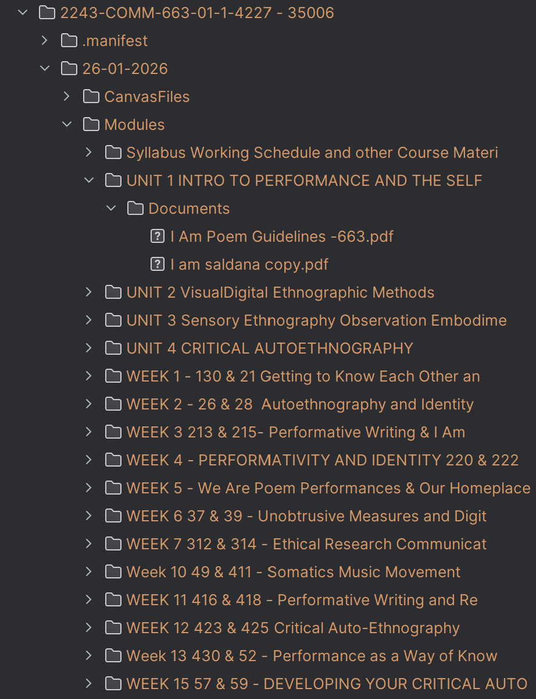
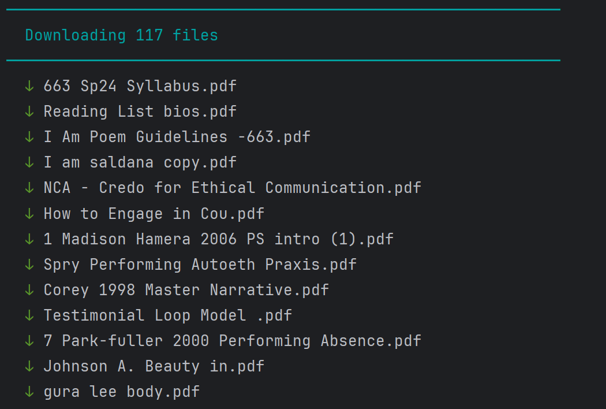
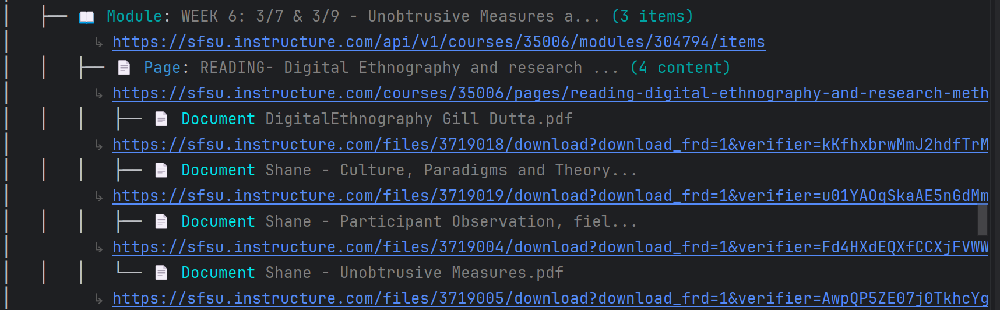
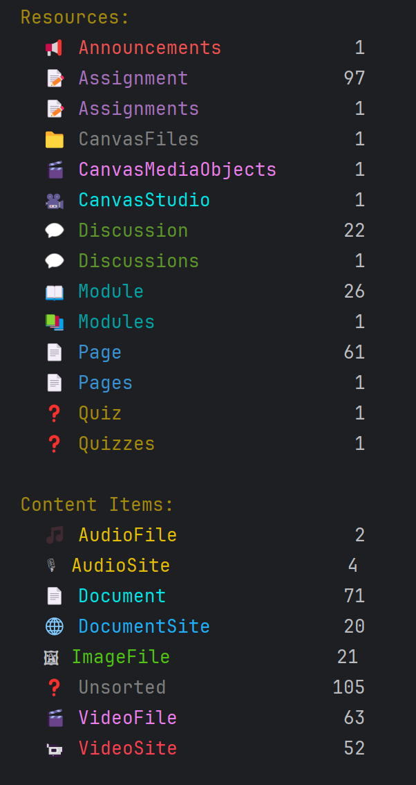
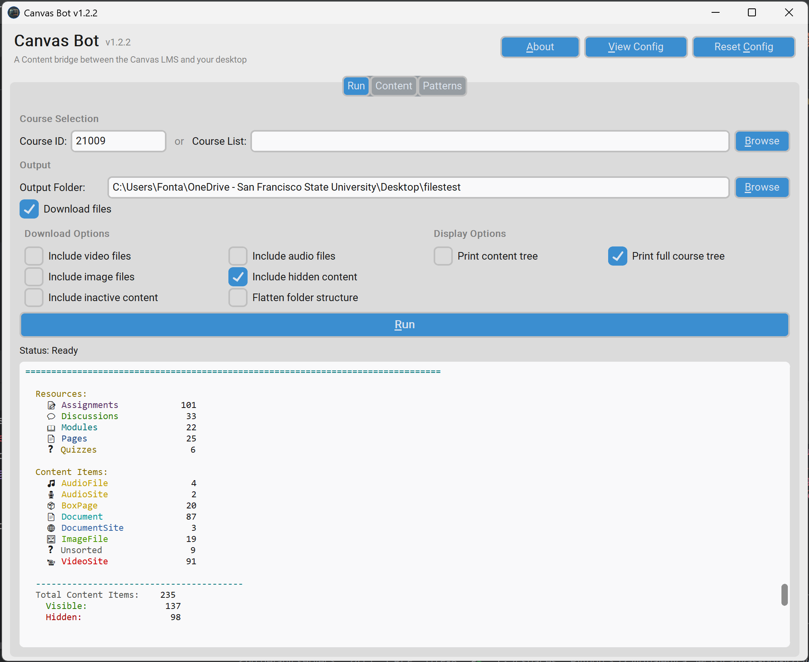
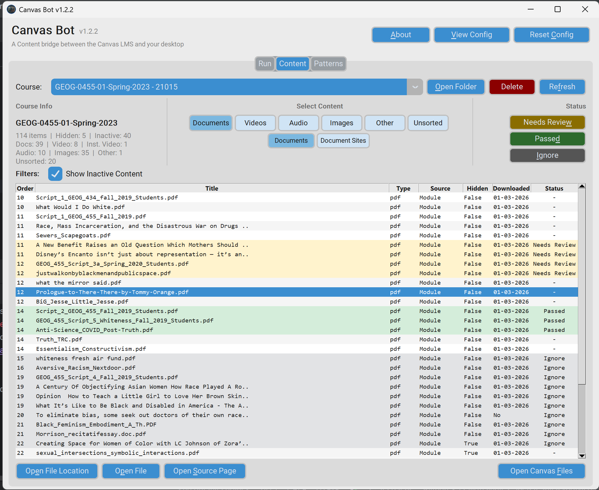
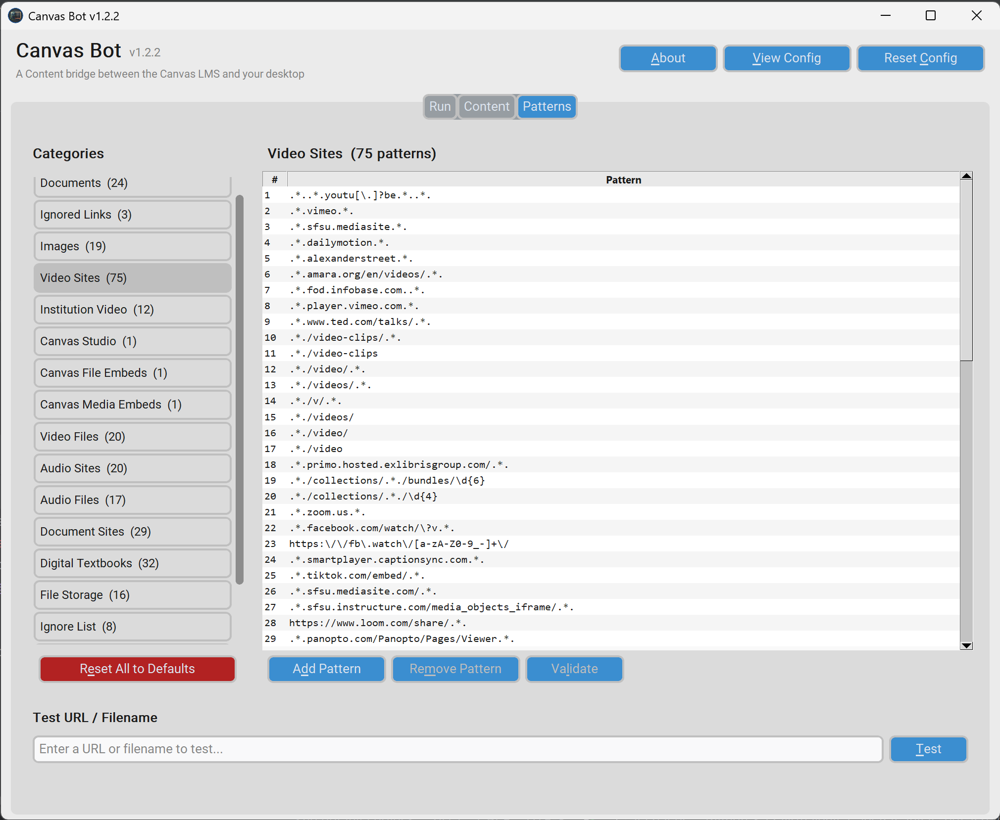

# CanvasBot

A tool for downloading, auditing, and organizing content from Canvas LMS courses. Available as a graphical desktop application or command-line tool.

## Table of Contents

- [Overview](#overview)
  - [Features](#features)
  - [Content Types](#content-types)
- [Requirements](#requirements)
- [Installation](#installation)
- [Quick Start](#quick-start)
  - [GUI Mode](#gui-mode)
  - [CLI Mode](#cli-mode)
- [Usage](#usage)
  - [Downloading Files](#downloading-files)
  - [Exporting Data](#exporting-data)
  - [Pattern Management](#pattern-management)
- [Configuration](#configuration)
- [Security and Privacy](#security-and-privacy)
- [Accessibility](#accessibility)
- [Pipeline Testing](#pipeline-testing)
- [Program Flags Reference](#program-flags-reference)
- [Obtaining a Canvas API Access Token](#obtaining-a-canvas-api-access-token)
- [Uninstall](#uninstall)
- [Support](#support)
- [License](#license)

## Overview

CanvasBot is a Windows application designed for accessible media coordinators and instructional designers at universities. It connects to Canvas LMS via the REST API to:

- **Download** all files from courses (documents, videos, audio, images)
- **Categorize** embedded content by type using configurable regex patterns
- **Export** content inventories to Excel or JSON for accessibility auditing
- **Track** download progress to avoid re-downloading files

CanvasBot operates in **read-only mode** by default — it reads course content via the Canvas API but never creates, modifies, or deletes any content, grades, enrollments, or settings in Canvas. The only exception is the **Replace File** feature, which explicitly uploads a replacement file to Canvas when initiated by the user.

CanvasBot can be used through a graphical user interface (GUI) or the command line (CLI). Double-click the executable or run without arguments to launch the GUI; pass command-line flags for scripted/automated workflows.

### Features

#### Structured File Downloads

Download course content into organized folder structures that mirror the Canvas course hierarchy. Files are organized by module, assignment, and content type for easy navigation.

```bash
Canvasbot.exe --course_id 12345 --download_folder "C:\Downloads" --include_video_files
```

**Output structure:**
```
Biology 101 - 12345/
├── 26-01-2026/
│   ├── Module 1 - Introduction/
│   │   ├── Week 1 Assignment/
│   │   │   └── Documents/
│   │   │       ├── Content Location.lnk  ← shortcut to Canvas page
│   │   │       └── syllabus.pdf
│   │   └── VideoFiles/
│   │       └── welcome_video.mp4
│   └── Module 2 - Cell Biology/
│       └── Documents/
│           └── lecture_notes.docx
```



---

#### Daily Incremental Downloads

CanvasBot tracks previously downloaded files in a manifest, so running it daily only downloads new content. Each run creates a date-stamped folder with only the files added since your last download.

```bash
# Run daily - only new files are downloaded
Canvasbot.exe --course_id 12345 --download_folder "C:\Downloads"
```

This makes it ideal for:
- Automated daily content audits
- Keeping local copies in sync with Canvas
- Archiving course materials over time



---

#### Visual Content Tree

Inspect course content structure directly in the terminal with a color-coded tree view. See all content types, hidden items, caption status, and clickable URLs at a glance.

```bash
# Content tree - only resources with content (hides empty branches)
Canvasbot.exe --course_id 12345 --print_content_tree

# Full course tree - shows all resources including empty ones
Canvasbot.exe --course_id 12345 --print_full_course
```

**Example output:**
```
🎓 Biology 101 | Course ID: 12345
│  ↳ https://yourschool.instructure.com/courses/12345
├── 📚 Modules
│   └── 📖 Module: Introduction to Biology
│       ├── 📄 Document: Syllabus.pdf
│       │               ↳ https://yourschool.instructure.com/files/123/download
│       ├── 🎬 VideoFile: Welcome Video.mp4
│       │               ↳ https://yourschool.instructure.com/files/456/download
│       └── 📹 VideoSite: Introduction Lecture
│                       ↳ https://www.youtube.com/watch?v=abc123
```

Features:
- Color-coded by content type
- `[hidden]` indicator for unpublished content
- Full URLs for easy access
- Content-only view hides empty modules and resource branches



After scanning, view a summary of all discovered content by type:



---

#### JSON Export for Integration

Export complete course content metadata to JSON for integration with other systems, custom reporting, or programmatic analysis.

```bash
Canvasbot.exe --course_id 12345 --output_as_json "C:\Reports"
```

Use cases:
- Feed into accessibility scanning tools
- Build custom dashboards
- Integrate with institutional reporting systems
- Archive course metadata

---

#### Excel Export for Analysis

Generate organized Excel workbooks (.xlsm) with content categorized across multiple sheets. Includes dropdown validation, conditional formatting, and hyperlinks for accessibility tracking workflows.

```bash
Canvasbot.exe --course_id 12345 --output_as_excel "C:\Reports"
```

**Sheets included:**
- Documents & Document Sites
- Video Files & Video Sites
- Audio Files & Audio Sites
- Image Files
- Unsorted Links

Features:
- Dropdown menus for tracking review status
- Hyperlinks to source pages and download URLs
- Hidden content flagging
- Ready for accessibility audit workflows

---

### Content Types

CanvasBot classifies content into these categories:

| Type | Description | Examples |
|------|-------------|----------|
| Documents | Downloadable document files | PDF, DOCX, PPTX, XLSX, ODT, EPUB, Pages |
| Document Sites | Cloud document platforms | Google Docs, OneDrive |
| Video Files | Downloadable video files | MP4, MOV, MKV |
| Video Sites | Video hosting platforms | YouTube, Vimeo, Panopto, Kaltura, YuJa, Echo360, Zoom, Wistia, Brightcove, Kanopy |
| Audio Files | Downloadable audio files | MP3, M4A, WAV |
| Audio Sites | Audio/podcast platforms | Podcast links |
| Image Files | Image files | JPG, PNG, GIF |
| File Storage Sites | Cloud storage | Box, Google Drive |
| Digital Textbooks | E-textbook platforms | Cengage, McGraw-Hill |
| Canvas Studio | Canvas Studio embeds | Institution media |
| Unsorted | Unclassified links | Everything else |

### Content Visibility

CanvasBot determines the visibility of each content item by combining Canvas API flags with link context. The Visibility column in the Content Viewer shows the effective student-facing visibility status:

| Canvas API Flag | Linked from a page/module? | Visibility Label | Meaning |
|---|---|---|---|
| None | Yes | **Visible** | Students can see and access the content |
| None | No | **Visible** | Not linked but not restricted |
| `hidden_for_user` / `hidden_from_students` | Yes | **Visible** | File is unlisted from the Files browser but still accessible via link |
| `hidden_for_user` / `hidden_from_students` | No | **Hidden** | Not linked anywhere and hidden from Files — students cannot access |
| `published = false` | Any | **Unpublished** | Draft state — completely invisible to students |
| `locked` | Any | **Locked** | Restricted by date range or prerequisites — students can see but not open |

Items with multiple flags show combined labels (e.g. "Unpublished, Locked").

The raw API flags are preserved in the JSON export (`is_hidden`, `hidden_reason`) for programmatic use. The Visibility column is a GUI-only interpretation that accounts for link context.

## Requirements

- Windows 10 or later
- Canvas API Access Token (read access to courses)
- For Excel export with macros: "Trust access to the VBA project object model" must be enabled in Excel (File > Options > Trust Center > Trust Center Settings > Macro Settings)

## Installation

### Executable (Recommended)

Download the latest executable from [Releases](https://github.com/Fontaineconsult/canvas-bot-v2/releases).

This is a standalone executable - no Python installation required.

### From Source

```bash
git clone https://github.com/Fontaineconsult/canvas-bot-v2.git
cd canvas-bot-v2
pip install -r requirements.txt
python canvas_bot.py --help
```

### First Launch on Windows

The executable is **code-signed** (publisher: **Daniel Fontaine**). Windows SmartScreen may still show a "Windows protected your PC" warning for new releases — this is normal and stops after enough users download the same version.

To proceed:
1. Click **"More info"**
2. Verify the publisher shows **"Daniel Fontaine"**
3. Click **"Run anyway"**

To verify your download, right-click the `.exe` → Properties → **Digital Signatures** tab, or compare the SHA256 checksum on the [Releases](https://github.com/Fontaineconsult/canvas-bot-v2/releases) page.

## Quick Start

### First Run Setup

On first run, you'll be prompted for:

1. **Canvas identifier** - Your institution's subdomain (e.g., `sfsu` for `https://sfsu.instructure.com`). All URLs are auto-generated from this.
2. **API Access Token** - Generated from Canvas settings (see [Obtaining a Canvas API Access Token](#obtaining-a-canvas-api-access-token))

### GUI Mode

Double-click the executable or run `python canvas_bot.py` with no arguments to launch the graphical interface. The GUI is organized into three tabs. All settings are saved between sessions. Click **About** for a built-in guide, or use **View Config** / **Reset Config** in the title bar to manage credentials.

#### Run

Enter a course ID (or select a batch `.txt` file), choose an output folder, and click **Run**. Download options let you include video, audio, image, hidden, or inactive content. Display options print a course tree to the log.



#### Content

Browse content from previously scanned courses. Select a course from the dropdown, then use the category buttons (Documents, Videos, Audio, Images, Other, Unsorted) to view content in sortable tables. Mark items as **Passed**, **Needs Review**, or **Ignore** for accessibility auditing — status is saved per course. Action buttons at the bottom open files, folders, and Canvas source pages.



#### Patterns

View and edit the regex patterns that classify content URLs. The left panel lists categories; the right panel shows patterns in the selected category. Use **Add**, **Remove**, and **Validate** to manage patterns, or **Test** a URL to see which categories match it.



### CLI Mode

Pass command-line flags for scripted or automated workflows:

```bash
# Download documents from a course
Canvasbot.exe --course_id 12345 --download_folder "C:\Downloads"

# Export course content to Excel
Canvasbot.exe --course_id 12345 --output_as_excel "C:\Reports"

# Export to JSON
Canvasbot.exe --course_id 12345 --output_as_json "C:\Reports"
```

## Usage

### Downloading Files

#### Single Course

```bash
Canvasbot.exe --course_id 12345 --download_folder "C:\Downloads"
```

#### Multiple Courses

Create a text file with course IDs (one per line):

```bash
Canvasbot.exe --course_id_list courses.txt --download_folder "C:\Downloads"
```

#### Include Additional File Types

By default, only documents are downloaded. Add flags for other types:

```bash
Canvasbot.exe --course_id 12345 --download_folder "C:\Downloads" \
    --include_video_files \
    --include_audio_files \
    --include_image_files
```

#### Flatten Directory Structure

Download all files to a single folder instead of preserving course structure:

```bash
Canvasbot.exe --course_id 12345 --download_folder "C:\Downloads" --flatten
```

#### Download Manifest

CanvasBot tracks downloaded files in `download_manifest.yaml` to prevent re-downloads. Each run creates a date-stamped folder with only new files. Delete the course folder to re-download everything.

#### Shortcuts for Failed Downloads

If a file cannot be downloaded (authentication required, unavailable, etc.), CanvasBot creates a Windows shortcut (.lnk) to the URL for manual investigation.

### Exporting Data

#### Excel Export

Generate a macro-enabled workbook (.xlsm) with content organized by type:

```bash
Canvasbot.exe --course_id 12345 --output_as_excel "C:\Reports"
```

**Sheets included:**
- Documents
- Document Sites
- Video Files
- Video Sites
- Audio Files
- Audio Sites
- Image Files
- Unsorted

Features:
- Dropdown validation for tracking status
- Conditional formatting
- Hyperlinks to source pages and downloaded files

#### JSON Export

Export all content metadata to JSON:

```bash
Canvasbot.exe --course_id 12345 --output_as_json "C:\Reports"
```

**Example output:**

```json
{
  "course_id": "12345",
  "course_name": "Introduction to Biology",
  "course_url": "https://yourschool.instructure.com/courses/12345",
  "content": {
    "documents": [
      {
        "title": "Syllabus.pdf",
        "url": "https://yourschool.instructure.com/files/123/download",
        "file_type": "pdf",
        "file_source": "Canvas",
        "source_page_type": "Page",
        "source_page_url": "https://yourschool.instructure.com/courses/12345/pages/welcome",
        "is_hidden": false,
        "hidden_reason": "",
        "order": 1
      }
    ],
    "videos": {
      "video_sites": [...],
      "video_files": [...]
    }
  }
}
```

#### Content Tree Visualization

Display the course structure in the console:

```bash
# Show only resources that contain content
Canvasbot.exe --course_id 12345 --print_content_tree

# Show complete course tree
Canvasbot.exe --course_id 12345 --print_full_course
```

### Pattern Management

CanvasBot decides how to classify every URL and filename it discovers by testing it against a series of [regular expression](https://en.wikipedia.org/wiki/Regular_expression) (regex) patterns. These patterns are organized into categories like `document_content_regex`, `web_video_resources_regex`, `ignore_list_regex`, and so on. When a URL matches a pattern in a category, CanvasBot assigns it to that content type — for example, a URL ending in `.pdf` matches `document_content_regex` and becomes a Document node, while a YouTube link matches `web_video_resources_regex` and becomes a VideoSite node. URLs that don't match any pattern are classified as Unsorted.

The default patterns cover common file types and popular platforms (YouTube, Vimeo, Google Docs, Box, etc.), but every institution has its own tools and services. You can add patterns to recognize institution-specific video platforms, custom document hosting, or any other content source that CanvasBot doesn't detect out of the box. You can also remove patterns that produce false positives or add entries to the ignore list to skip URLs you don't care about.

Patterns use Python's `re` module syntax with case-insensitive matching. If you're new to regular expressions, [Pythex](https://pythex.org/) is a helpful tool for building and testing patterns interactively before adding them to CanvasBot.

Patterns can be managed from the **Patterns tab** in the GUI or via CLI flags:

#### List Patterns

```bash
# List all pattern categories
Canvasbot.exe --patterns-list

# List patterns in a specific category
Canvasbot.exe --patterns-list document_content_regex
```

#### Add Patterns

```bash
# Add a pattern (with confirmation prompt)
Canvasbot.exe --patterns-add document_content_regex ".*\.odt"

# Add without confirmation
Canvasbot.exe --patterns-add document_content_regex ".*\.odt" -y
```

#### Remove Patterns

```bash
Canvasbot.exe --patterns-remove document_content_regex ".*\.odt" -y
```

#### Test Pattern Matching

```bash
# Test what categories match a URL or filename
Canvasbot.exe --patterns-test "myfile.pdf"
Canvasbot.exe --patterns-test "https://youtube.com/watch?v=abc123"
```

#### Validate Pattern Syntax

```bash
Canvasbot.exe --patterns-validate ".*\.pdf"
```

#### Reset to Defaults

```bash
Canvasbot.exe --patterns-reset -y
```

## Configuration

### Credential Storage

Credentials are stored securely in Windows Credential Vault:
- Canvas API Token
- Canvas Studio OAuth tokens (client ID, secret, access/refresh tokens)

### Configuration Files

| File | Location | Purpose |
|------|----------|---------|
| `config.json` | `%APPDATA%\canvas bot\` | Instance URLs and settings |
| `re.yaml` | `%APPDATA%\canvas bot\` | User-customized patterns |
| `gui_settings.json` | `%APPDATA%\canvas bot\` | Saved GUI inputs (folders, checkboxes) |
| `canvas_bot.log` | `%APPDATA%\canvas bot\` | Application logs |

### Reset Configuration

From the GUI, use the **View Config** and **Reset Config** buttons in the title bar.

From the CLI:

```bash
# Reset Canvas API credentials
Canvasbot.exe --reset_canvas_params

# Reset Canvas Studio OAuth
Canvasbot.exe --reset_canvas_studio_params

# View current configuration status
Canvasbot.exe --config_status
```

## Security and Privacy

CanvasBot handles sensitive credentials and institutional course content. The following measures are in place to protect this data.

### Credential Protection

- **Encrypted storage** — API tokens and OAuth credentials are stored in the Windows Credential Vault via the `keyring` library, never in plaintext configuration files.
- **In-memory isolation** — After loading from the Credential Vault, credentials are held in a private module-level store rather than process environment variables. This prevents leakage to child processes, debugging tools, or other libraries reading `os.environ`.
- **Automatic cleanup** — Credentials are cleared from memory when the application exits via `atexit` handler.

### Transport Security

- **TLS certificate verification** — All Canvas API and Studio API calls validate SSL/TLS certificates. Connections to servers with invalid or expired certificates are rejected.

### Logging and Audit Trail

- **Sensitive data stripped from logs** — API tokens, email addresses, and other sensitive query parameters are removed from all URLs before they are written to log files or displayed in warnings.
- **Audit trail** — Structured log entries track course scan start/completion, download summaries, and export operations with course IDs and item counts.
- **User and session identification** — Every log entry includes the Windows username and a unique session ID for attribution on shared machines.
- **Unhandled exception logging** — All unexpected errors are captured with full tracebacks for debugging, including a global exception hook as a safety net.
- **Log file permissions** — Log files are stored under `%APPDATA%\canvas bot\`, which is per-user protected on Windows. Best-effort file permission restrictions are applied on creation.
- **No sensitive content in logs** — Logs contain course IDs, file counts, timestamps, and error messages. No file contents, student data, or credentials are recorded.

### Input Validation

- **Course ID validation** — Course IDs are validated as numeric before being used in API requests, in both CLI and GUI modes. Batch course list files skip invalid entries with per-line warnings.
- **Filename sanitization** — Downloaded filenames are stripped of invalid Windows characters and truncated to respect path length limits.
- **Regex validation** — User-supplied patterns are validated with `re.compile()` before being saved.

### File Open Protection

- **Executable blocklist** — The "Open File" button in the Content Viewer enforces a hardcoded blocklist of dangerous file extensions (`.exe`, `.bat`, `.cmd`, `.ps1`, `.vbs`, `.js`, `.msi`, `.dll`, `.lnk`, `.hta`, macro-enabled Office formats, and others). Blocked files cannot be opened via `os.startfile()` and display a warning dialog instead.

### Process Isolation

- **No shell injection** — GUI subprocess calls use argument lists instead of shell string interpolation, preventing command injection.
- **No dynamic code execution** — The application does not use `eval()`, `exec()`, or similar constructs.

### Data Storage

All application data is stored under `%APPDATA%\canvas bot\`, a per-user protected directory on Windows:

| Data | Location | Sensitivity |
|------|----------|-------------|
| API tokens | Windows Credential Vault | High (encrypted) |
| Instance config | `config.json` | Low (URLs only) |
| Application logs | `canvas_bot.log` | Medium (URLs, errors — tokens stripped) |
| GUI settings | `gui_settings.json` | Low (paths, preferences) |
| Downloaded content | User-specified folder | Varies (course content) |

Downloaded course content is stored as-is in user-specified folders. Canvas Bot does not transmit downloaded content to any third party — all data remains on the local machine.

**FERPA note:** Downloaded course content may contain FERPA-protected information (student names in page titles, discussion references, etc.). Handle downloaded materials per your institution's data governance policy, store them on an encrypted drive (e.g., BitLocker), and delete downloads when they are no longer needed.

For IT administrators evaluating Canvas Bot, a detailed security summary is available at [`claude/IT_SECURITY.md`](claude/IT_SECURITY.md).

## Accessibility

The GUI is built with CustomTkinter, which has inherent limitations with screen reader support. Within those constraints, Canvas Bot implements the following accessibility features:

### What Works Well

- **Full keyboard access** — every interactive element is reachable via Tab/Shift+Tab and activatable with Enter. Tab selector buttons support Left/Right arrow navigation. Pattern categories support Up/Down arrows.
- **Keyboard shortcuts** — Alt+key shortcuts are provided for all buttons across all tabs, with underlined mnemonic characters. Tab switching via Alt+U/N/P and Ctrl+1/2/3. All shortcuts require a modifier key (no single-character shortcuts).
- **Visible focus indicators** — all buttons, entries, checkboxes, and dynamically created controls display a 2px blue focus ring in both light and dark modes.
- **Color is never the sole indicator** — review status rows use background color (green/yellow/gray) but always include a text label in the Status column. The status bar uses a "WARNING" text prefix alongside orange color. Pattern test results include "MATCH:" / "No matches" prefixes alongside color.
- **Error identification** — validation errors in the Add Pattern dialog display descriptive text and return focus to the input field. Status bar errors include text prefixes.
- **Logical focus and reading order** — tab order matches the visual layout. Dialogs set initial focus on the primary action. Escape closes all dialogs.
- **Tooltips** — all controls have descriptive tooltips that appear on hover and keyboard focus, showing the associated shortcut key.

### Known Limitations (CustomTkinter Framework)

These cannot be resolved without migrating to a different GUI framework:

- **No screen reader support** — CustomTkinter widgets do not expose name, role, or value to Windows UI Automation or MSAA. Screen readers (NVDA, JAWS, Narrator) have severely limited support.
- **No live region announcements** — status bar changes and console output cannot be pushed to assistive technology.
- **No semantic structure** — no heading levels, landmark regions, or programmatic language declaration.
- **No user text spacing control** — font rendering is fixed by the Tk engine.

A detailed WCAG 2.1 conformance report is available at [`claude/WCAG_VPAT.md`](claude/WCAG_VPAT.md).

## Pipeline Testing

CanvasBot includes a testing framework to validate the content extraction pipeline.

### Purpose

Validates that raw Canvas API data is correctly transformed:
- `display_name` vs `filename` handling
- URL decoding of filenames
- Extension preservation
- Windows-safe filename generation

### Usage

```bash
# Collect test data from courses (requires API access)
python -m test.pipeline_testing batch-collect --range 34000-35000 --output corpus.json

# Run tests offline against collected data
python -m test.pipeline_testing batch-test --corpus corpus.json

# Direct comparison of raw vs processed output
python -m test.pipeline_testing compare --raw raw.json --processed processed.json
```

### Test Commands

| Command | Description |
|---------|-------------|
| `collect` | Collect raw API data from single course |
| `batch-collect` | Collect from many courses (1 API call each) |
| `batch-test` | Test pipeline offline against corpus |
| `test` | Direct pipeline test against raw data |
| `compare` | Compare raw API vs processed output |
| `side-by-side` | Visual comparison output |

## Program Flags Reference

### Course Selection

| Flag | Description |
|------|-------------|
| `--course_id TEXT` | Single course ID to process |
| `--course_id_list TEXT` | File containing course IDs (one per line) |

### Output Options

| Flag | Description |
|------|-------------|
| `--download_folder TEXT` | Directory for downloaded files |
| `--output_as_json TEXT` | Export content to JSON (specify directory) |
| `--output_as_excel TEXT` | Export content to Excel (specify directory) |
| `--print_content_tree` | Display course tree showing only resources with content |
| `--print_full_course` | Display complete course tree including all resources |

### Download Options

| Flag | Description | Default |
|------|-------------|---------|
| `--include_video_files` | Include video files in download | False |
| `--include_audio_files` | Include audio files in download | False |
| `--include_image_files` | Include image files in download | False |
| `--include_inactive_content` | Include files not linked from any active Canvas page | False |
| `--flatten` | Download all files to single directory | False |
| `--download_hidden_files` | Include content hidden from students | False |
| `--flush_after_download` | Delete files after processing | False |

### Pattern Management

| Flag | Description |
|------|-------------|
| `--patterns-list [CATEGORY]` | List all patterns or patterns in category |
| `--patterns-add CATEGORY PATTERN` | Add pattern to category |
| `--patterns-remove CATEGORY PATTERN` | Remove pattern from category |
| `--patterns-test TEXT` | Test what categories match input |
| `--patterns-validate TEXT` | Validate regex syntax |
| `--patterns-reset` | Reset patterns to defaults |
| `-y` | Skip confirmation prompts |

### File Replace

| Flag | Description |
|------|-------------|
| `--replace_file TEXT` | Path to local file to upload as replacement (requires `--canvas_file_id` and `--course_id`) |
| `--canvas_file_id TEXT` | Canvas file ID of the file to replace (requires `--replace_file` and `--course_id`) |

### Configuration

| Flag | Description |
|------|-------------|
| `--reset_canvas_params` | Reset Canvas API credentials |
| `--reset_canvas_studio_params` | Reset Canvas Studio OAuth |
| `--config_status` | Show current configuration |

## Obtaining a Canvas API Access Token

1. Log into Canvas
2. Go to **Account > Settings**
3. Scroll to **Approved Integrations**
4. Click **+ New Access Token**
5. Name your token and click **Generate Token**
6. Copy the token immediately (it won't be shown again)

The token is stored encrypted in Windows Credential Vault.

### Permission Requirements

CanvasBot only requires **read access** to courses.

### Institutional / Service Account Deployment

For department-wide use, we recommend creating a dedicated Canvas service account rather than using individual staff tokens:

1. Create a Canvas account with **read-only enrollment** across the courses you need to audit
2. Generate a single API token from that account
3. Distribute the Canvas Bot executable to staff — each user configures the same service account token on first run

This provides centralized access control: revoking the service account token immediately disables Canvas Bot for all users. Individual staff do not need to manage their own tokens or have personal API access.

## Uninstall

Canvas Bot is a portable application with no installer. To fully remove it:

1. **Delete the executable** from wherever you saved it
2. **Delete application data:** `%APPDATA%\canvas bot\` (contains config, logs, GUI settings, and user patterns)
3. **Remove stored credentials:** open Windows Credential Manager, search for entries containing "canvas", and delete them
4. **Revoke your API token:** in Canvas, go to Account > Settings > Approved Integrations and delete the token
5. **Delete downloaded content** from your output folders if no longer needed

## Support

Contact: fontaine@sfsu.edu

For bug reports and feature requests: [GitHub Issues](https://github.com/Fontaineconsult/canvas-bot-v2/issues)

## Version History

### 1.2.2

**GUI:**
- **Tabbed interface** — reorganized the GUI into three tabs (Run, Content, Patterns) with `Ctrl+1/2/3` keyboard shortcuts to switch between them.
- **Consolidated output** — replaced three separate folder pickers with a single Output Folder and three action checkboxes (Download files, Export to Excel, Export to JSON).
- **Content Viewer** — a persistent browser for all previously scanned courses. Scans the output folder for `.manifest/` JSON files and populates a course dropdown. Content is displayed in nested sub-tabs (Documents, Videos, Audio, Images, Unsorted) with sortable tables, a summary banner, a detail panel with clickable URLs, and buttons to open file locations or source pages. A "Downloaded" column checks whether each file exists at its expected path.
- **Pattern Manager** — full GUI for managing regex patterns from `re.yaml`. Left column lists all pattern categories with counts; right column shows patterns for the selected category with Add, Remove, and Validate buttons. Bottom panel tests a URL or filename against all compiled matchers with live reload. "Reset All to Defaults" restores the bundled `re.yaml`. Category visibility is configurable at the code level to hide internal categories. Patterns with `{CANVAS_DOMAIN}` placeholders display substituted values for readability.
- **Reusable table widget** — `ContentTable` class wrapping `ttk.Treeview` with scrollbars, column-header sorting, alternating row colors, and automatic dark/light theme matching.
- **Focus rings and tooltips** — all interactive elements across Content and Patterns tabs show focus rings and descriptive tooltips, matching the Run tab's accessibility features.
- **Content tab auto-refresh** — switching to the Content tab automatically refreshes the course list.

**Default Patterns:**
- **Expanded document patterns** — added 9 accessibility-relevant file types: ODT, ODP, ODS, Key, Numbers, Pub, EPUB, XPS, 7z.
- **Expanded video site patterns** — added 47 new video platform patterns covering Panopto, Kaltura, YuJa, Wistia, Brightcove, Echo360, Kanopy, Loom, ScreenPal, Flipgrid/Flip, Microsoft Stream, Twitch, Instagram Reels, LinkedIn Video, and many more.
- **Institution-specific video patterns** — populated the `institution_video_services_regex` category with 12 `{CANVAS_DOMAIN}`-prefixed patterns for platforms that use institution subdomains (Panopto, Kaltura, YuJa, Echo360, Kanopy, ShareStream, Ensemble, ScreenPal).

**Content Pipeline:**
- **Module anchor URLs in source page links** — when content is discovered inside a Module (which has no direct `html_url`), the source page URL is now constructed as `{course_url}/modules#{module_id}`. This creates an anchor link that scrolls directly to the correct module on the Canvas modules page, rather than linking to the generic modules listing.
- **Active content filtering** — downloads now skip files not linked from any active Canvas page by default. Use `--include_inactive_content` (CLI) or the "Include inactive content" checkbox (GUI) to override. The Content Viewer also has a "Show Inactive Content" filter toggle.

**Content Viewer:**
- **Downloaded column shows download date** — file tables now display the actual download date (from the date-stamped folder on disk) instead of "Yes", with glob-based search across date folders for files downloaded on previous days.
- **Empty table placeholders** — tables with no content show "No {Content Type} Found" instead of an empty table.

**Content Pipeline:**
- **Robust file type detection** — centralized `get_file_type()` helper with a 7-step fallback chain replaces inconsistent inline logic, improving `file_type` accuracy in JSON and Excel exports.
- **Canvas Studio downloads use correct URL** — Studio video downloads now use the DRM video stream URL instead of the Studio page URL.

**Stability:**
- **OSError handler for disconnected drives** — the downloader now catches `OSError` during file writes (e.g., when a network drive is disconnected mid-download) and exits cleanly with a message instead of crashing with a traceback.
- **Pattern placeholder substitution fix** — environment variables are now loaded at Pattern Manager init time so `{CANVAS_DOMAIN}` tokens display correctly.
- **Regex pattern reloading** — patterns with domain placeholders (`{CANVAS_STUDIO_DOMAIN}`, `{CANVAS_DOMAIN}`, etc.) are now recompiled after config loads, fixing Canvas Studio embeds and Box links being classified as Unsorted.

### 1.2.0

**GUI:**
- **Graphical user interface** — double-click the executable or run with no arguments to launch a desktop GUI built with CustomTkinter. CLI mode is still available by passing flags.
  - Course selection (single ID or batch `.txt` file), output folder pickers, download/display option checkboxes, real-time log output, status bar
  - **Settings persistence** — all GUI inputs saved to `%APPDATA%\canvas bot\gui_settings.json` and restored on next launch
  - **About dialog** — overview of Canvas Bot, guide to every GUI section, first-time setup steps, and contact info
  - **View Config / Reset Config buttons** — manage credentials directly from the GUI
  - **Accessibility** — keyboard shortcuts (`Alt+R/V/C/A`), Tab focus navigation with visible focus rings, tooltips on all controls, Escape to close dialogs

**Excel Export:**
- **Robust COM automation** — VBA insertion now handles corrupted type library caches, missing Trust Center permissions (with step-by-step fix instructions), and invalid hyperlink values gracefully instead of crashing
- **Stale file lock detection** — existing `.xlsm` files are removed before writing; locked files produce a clear error message
- **Path normalization** — GUI folder paths are normalized to prevent `PermissionError` on mapped network drives

**Other:**
- Application icon (`cb.ico`) displayed in window titlebar and taskbar
- Removed `--export_course_list`, `--semester_filter`, and `--check_video_site_caption_status` CLI flags

### 1.1.0

**Improvements:**
- **Simplified first-run setup** — only asks for the Canvas subdomain (e.g., `sfsu`). All URLs are auto-generated. Removed multi-step wizard and optional prompts for Box/Library Proxy domains.
- **Split tree display into two modes** — `--print_content_tree` shows only resources with content (empty branches hidden); `--print_full_course` shows everything. Replaces the old `--show_content_tree` flag.
- **Content Location shortcuts** — download folders now include a `Content Location.lnk` shortcut that links directly to the Canvas page containing the content, making it easy to navigate back for inspection or remediation.
- **Safe folder deletion** — `clear_folder_contents()` now verifies the target contains a Canvas Bot manifest before deleting, preventing accidental deletion of unrelated folders.
- **Warning collector for animated spinners** — network errors are now buffered silently during import and displayed in a single Error Report block after import completes, preventing error messages from corrupting spinner animations.
- **Cleaner API error messages** — network errors show human-readable status and message instead of raw JSON dicts. Access tokens are stripped from URLs before display.
- **Canvas tree stats cleanup** — container nodes filtered from Content Summary, resource labels pluralized, content URLs indented deeper than resource URLs for visual distinction.
- **Security** — API access tokens stripped from log files; duplicate log handler removed.
- **EXE test harness** — automated test suite (64 offline + 20 API tests) validates every CLI flag combination.

**Bug Fixes:**
- Fixed Pages import spinner incorrectly labeled as "Importing Announcements"
- Fixed `AttributeError` from call to deleted `_print_url_legend()` method
- Fixed missing manifest registration in Announcement class
- Fixed blocking `input()` call in caption upload error path

### 1.0.0

**Major release** with significant new features and stability improvements.

**New Features:**
- Pattern management CLI (`--patterns-list`, `--patterns-add`, `--patterns-remove`, `--patterns-test`, `--patterns-validate`, `--patterns-reset`)
- Pipeline testing framework for validating content extraction
- Course list export with semester filtering (`--export_course_list`, `--semester_filter`)
- Configuration status command (`--config_status`)

**Bug Fixes:**
- Fixed filename derivation to prefer `display_name` over URL-encoded `filename`
- Added URL decoding for filenames (converts `+` to spaces)
- Improved Canvas Studio embed detection

**Testing:**
- Validated against 27,000+ files across 499 courses with 99.7% pass rate

### 0.1.5

- Canvas Studio integration
- Many bug fixes

### 0.1.2

- Macro-enabled Excel workbook export
- YouTube API integration for caption checking
- Logging system

### 0.1.0

- Initial release

## Future Features

- [ ] LTI / SCORM / External Tool detection — identify third-party content that is outside institutional control for accessibility compliance review
- [x] GUI interface (added in v1.2.0)
- [x] Content Viewer for browsing scanned course data (added in v1.2.2)
- [x] Pattern Manager GUI for regex CRUD (added in v1.2.2)
- [ ] Better Box/Dropbox/Google Drive support
- [ ] Batch accessibility reporting

## Known Issues

- Long directory paths may cause issues on Windows (260 character limit)
- Some shortcut creation may fail depending on path characters

## License

Creative Commons Attribution-NonCommercial 4.0 International (CC-BY-NC-4.0)

Copyright (c) 2023-2026 Daniel Fontaine

You are free to:

- **Share** — copy and redistribute the material in any medium or format
- **Adapt** — remix, transform, and build upon the material

Under the following terms:

- **Attribution** — You must give appropriate credit, provide a link to the license, and indicate if changes were made.
- **NonCommercial** — You may not use the material for commercial purposes.
- **No additional restrictions** — You may not apply legal terms or technological measures that legally restrict others from doing anything the license permits.

Full license text: https://creativecommons.org/licenses/by-nc/4.0/legalcode
